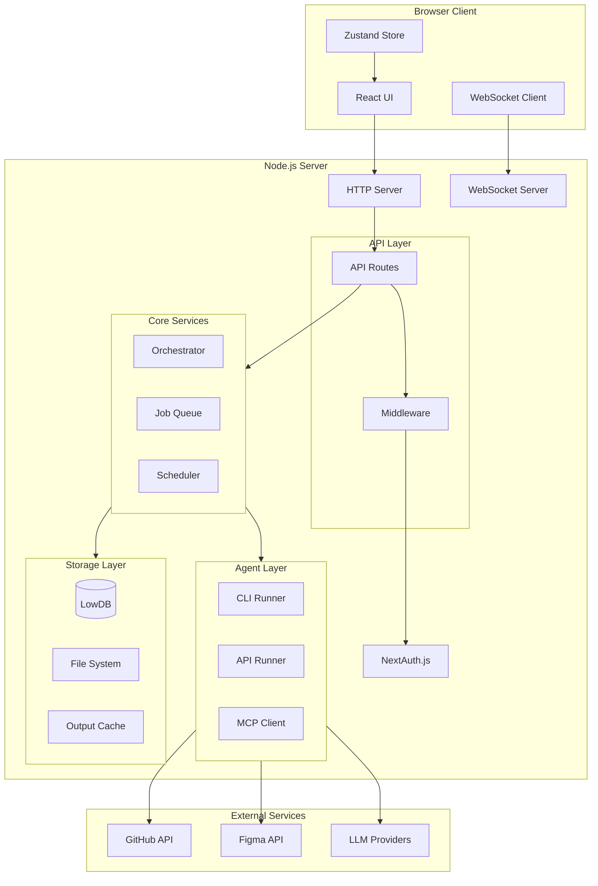
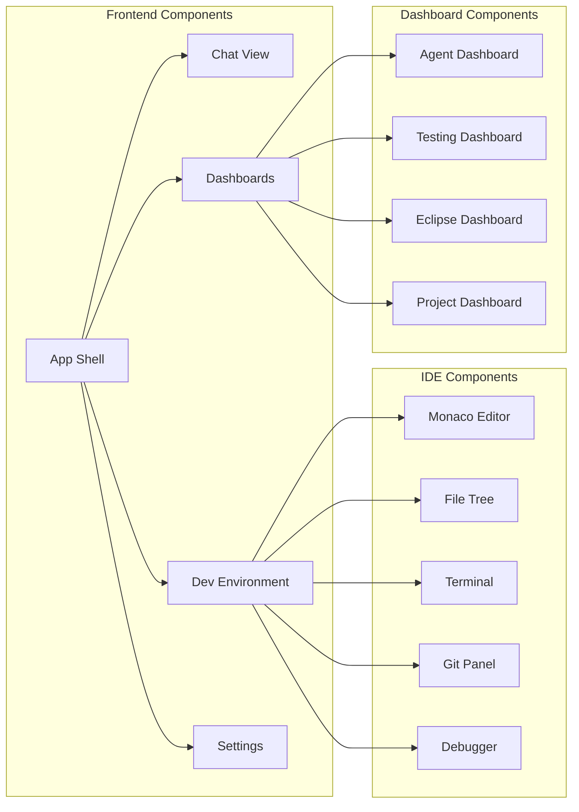
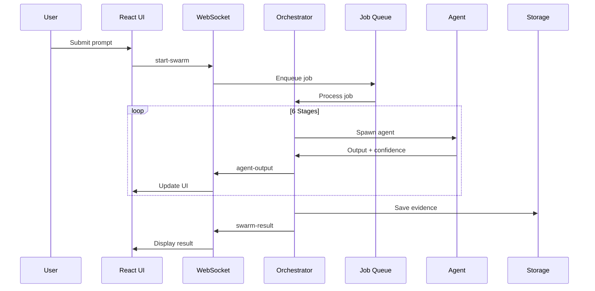
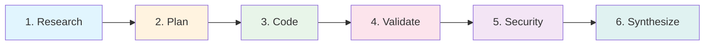
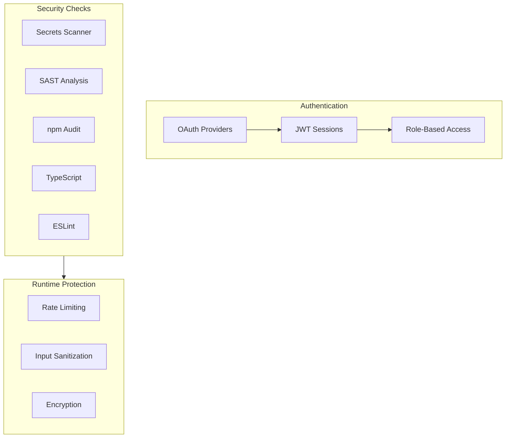
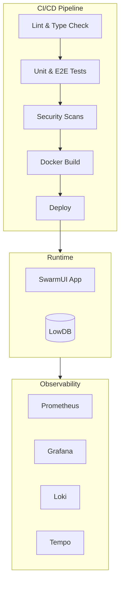

# SwarmUI Architecture

## System Overview



## Component Architecture



## Data Flow



## Pipeline Stages



## Security Architecture



## Deployment Architecture



## Technology Stack

| Layer | Technology |
|-------|------------|
| Frontend | Next.js 15, React 19, TypeScript 5, Tailwind CSS v4 |
| State | Zustand 5 |
| UI Components | Shadcn/ui, Radix UI |
| Editor | Monaco Editor |
| Terminal | XTerm.js |
| Backend | Node.js, Next.js API Routes |
| WebSocket | ws |
| Database | LowDB (JSON) |
| Auth | NextAuth.js (Auth.js v5) |
| Testing | Vitest, Playwright |
| CI/CD | GitHub Actions |
| Monitoring | Prometheus, Grafana, Loki, Tempo |
| Container | Docker |

## Directory Structure

```
swarm-ui/
├── app/                    # Next.js App Router
│   ├── api/               # API Routes
│   │   ├── auth/          # NextAuth endpoints
│   │   ├── files/         # File system API
│   │   ├── git/           # Git operations
│   │   ├── health/        # Health checks
│   │   ├── jobs/          # Job queue API
│   │   ├── projects/      # Project management
│   │   └── ...
│   ├── login/             # Login page
│   ├── globals.css        # Tailwind v4 styles
│   └── layout.tsx         # Root layout
├── components/            # React components
│   ├── ui/               # Shadcn/ui primitives
│   ├── app-shell.tsx     # Main app container
│   ├── chat-view.tsx     # Chat interface
│   ├── dev-environment.tsx # IDE panel
│   └── ...
├── lib/                   # Shared utilities
│   ├── store.ts          # Zustand store
│   ├── types.ts          # TypeScript types
│   └── ws-client.ts      # WebSocket client
├── server/               # Server-side code
│   ├── orchestrator.ts   # Pipeline orchestrator
│   ├── job-queue.ts      # Background jobs
│   ├── cli-runner.ts     # Agent spawning
│   └── ...
├── e2e/                  # Playwright tests
├── docs/                 # Documentation
└── monitoring/           # Observability configs
```

## Key Architectural Decisions

### 1. Monorepo with Next.js
Single codebase for frontend and backend, simplifying deployment and development.

### 2. WebSocket for Real-time Updates
Bidirectional communication for live agent output streaming during pipeline execution.

### 3. Job Queue for Background Processing
Persistent job queue ensures pipeline runs survive browser disconnects.

### 4. LowDB for Simplicity
JSON-based storage eliminates database setup complexity while supporting persistence.

### 5. Multi-Agent Pipeline
6-stage pipeline (Research → Plan → Code → Validate → Security → Synthesize) with confidence scoring and consensus.
